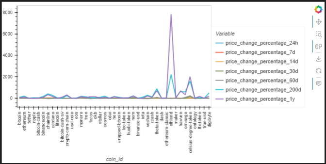
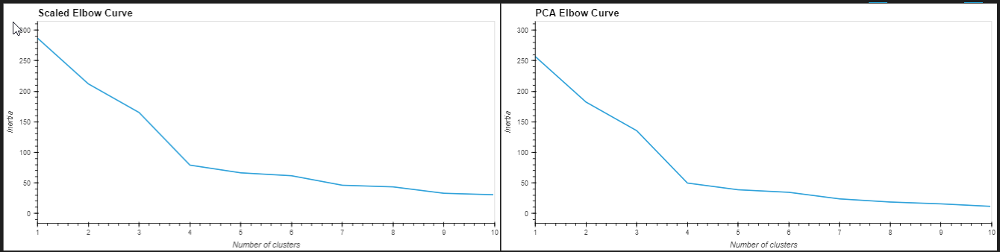
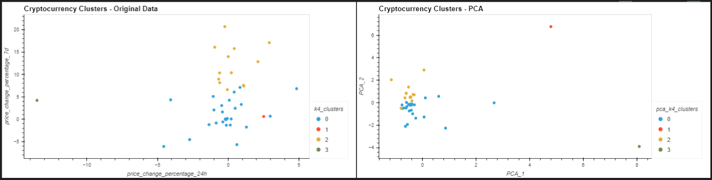

# CryptoClustering

Predict if cryptocurrencies are affected by 24-hour or 7-day price changes. 

The data for this project is the crypto_market_data.csv:

With this dataset, the final question was answered:

  * **Question:** After visually analyzing the cluster analysis results, what is the impact of using fewer features to cluster the data using K-Means?

  * **Answer:** With regards to the elbow curves, it shows that reducing the number of features did not affect the number of clusters; therefore, k remained as 4. 
  * With regards to the cluster plots, it demonstrated that having fewer features improve the clarity of clusters which makes it easier to interpret. This is potentially caused by the reduction of noise caused by the other features; however, it is important to NOT omit important features that could have influenced the clustering results. 